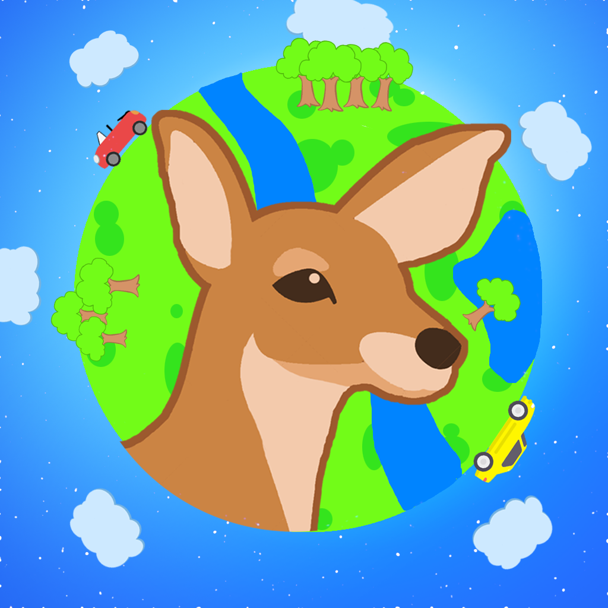

# SummerGameKeaneMocarski
While we (Jonathan Keane and Kacper Mocarski) have time during quarantine, we decided we could learn a new language and create a cool project through Unity where we create a video game (more details of the game below).

# Deer Dash
In this game, the goal is to move your vehicle to avoid the deers that are running across the screen, while at the same time managing your fuel, collecting coins and powerups, and not driving off the side of the road. This game operates in 3D and we developed it to have many different cars, animals, and worlds! This game is being developed to be playable on Android and iPhone and will be free to play. We used Blender to design our own animals, cars and terrains and we used GarageBand to create some background music for the game.

<b>SCALED</b>

# Features of the Programming Done:
- The game saves player data in a binary file on the device played, so that player settings can be restored after leaving and reentering the app. 
- The deer/animals always come within a certain range of the car no matter the speed by using kinematics equations in physics to project where the deer/animal will be relative to the velocity of the car. 
- The game will have advertisements that can be watched to gain extra in-game rewards
- Almost every piece of the game is customizable:
  * Car
  * Terrain (changes animals with this)
  * Sunlight (can selected time of day or even night mode with headlights)
- Reward pathway that let users earn rewards for driving a certain number of miles
- Daily reward that lets you spin a wheel for a prize
